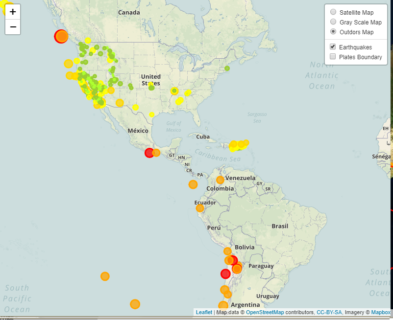
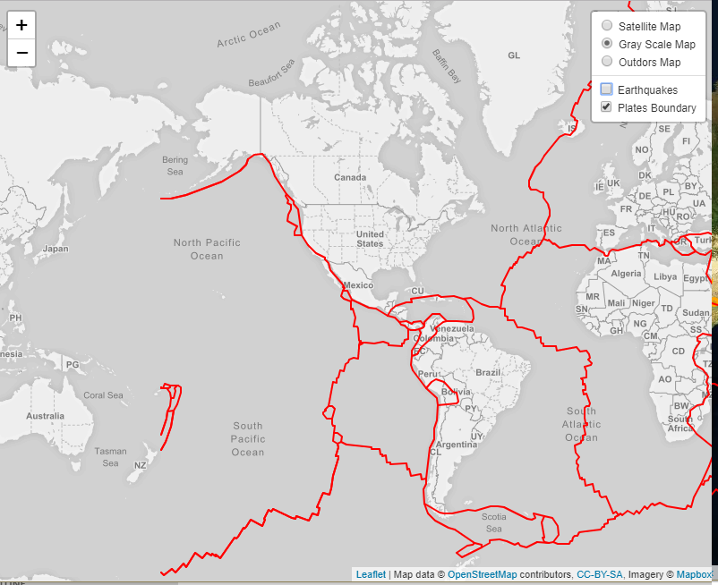

# Flood Management Dashboard for Mumbai 

# Background

Project tries to add the Major Water Logging (Flood Prone) Areas Locations in Mumbai

# Goals
Your first task is to visualize an Major Water Logging data set.

Import & Visualize the Data

Create a map using Leaflet that plots all of the Major Water Logging from data set based on their longitude and latitude.

Data markers should reflect the probability of the Water Logging in their size and color. Water Logging areas with higher probability should appear larger and darker in color.

Include popups that provide additional information about the floods when a marker is clicked.

Create a legend that will provide context for your map data.

Your visualization should look something like the map above.

Plot a second data set on our map.

Add a number of base maps to choose from as well as separate out our two different data sets into overlays that can be turned on and off independently.

Add layer controls to our map.

# Run Locally

Run this command git clone https://github.com/tayyabsayyad/flood-management.git

Make sure you have installed in your computer all libraries used above 

Double check if you are in the right directory in you terminal ...that often cause errors

Open with default browser: index.html 

You are now in the dev environment and you can play around

# Findings

