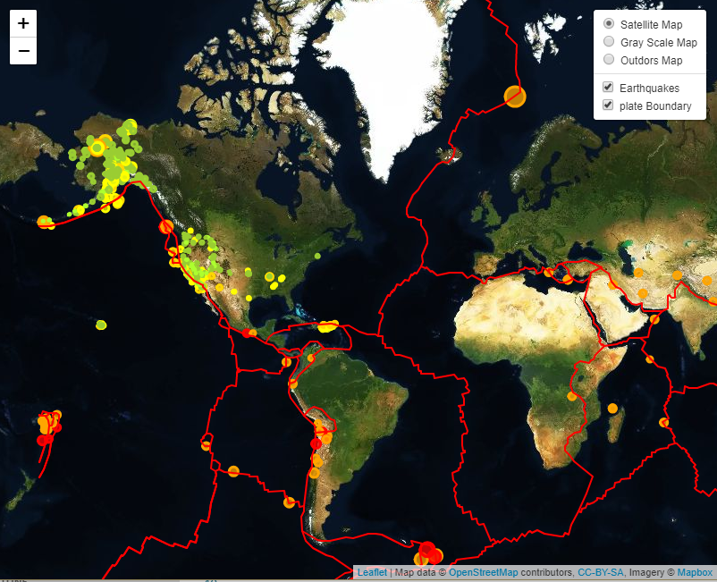

# Earthquake-Dashboard-with-MAPBOX
Project

# Background
Welcome to the United States Geological Survey, or USGS for short! The USGS is responsible for providing scientific data about natural hazards, the health of our ecosystems and environment; and the impacts of climate and land-use change. Their scientists develop new methods and tools to supply timely, relevant, and useful information about the Earth and its processes. As a new hire, you will be helping them out with an exciting new project!
The USGS is interested in building a new set of tools that will allow them visualize their earthquake data. They collect a massive amount of data from all over the world each day, but they lack a meaningful way of displaying it. Their hope is that being able to visualize their data will allow them to better educate the public and other government organizations (and hopefully secure more funding..) on issues facing our planet.

The USGS provides earthquake data in a number of different formats, updated every 5 minutes. Visit the USGS GeoJSON Feed page and pick a data set to visualize. When you click on a data set, for example 'All Earthquakes from the Past 7 Days'. 

# Goals
Your first task is to visualize an earthquake data set.

Import & Visualize the Data

Create a map using Leaflet that plots all of the earthquakes from your data set based on their longitude and latitude.

Your data markers should reflect the magnitude of the earthquake in their size and color. Earthquakes with higher magnitudes should appear larger and darker in color.

Include popups that provide additional information about the earthquake when a marker is clicked.

Create a legend that will provide context for your map data.

Your visualization should look something like the map above.

Plot a second data set on our map.

Add a number of base maps to choose from as well as separate out our two different data sets into overlays that can be turned on and off independently.

Add layer controls to our map.

# Run Locally

Run this command git clone https://github.com/Piterbrito/USGS-earthquakes--MapDashboard/

Make sure you have installed in your computer all libraries used above 

Double check if you are in the right directory in you terminal ...that often cause errors

Open with default browser: index.html 

You are now in the dev environment and you can play around

# Findings

